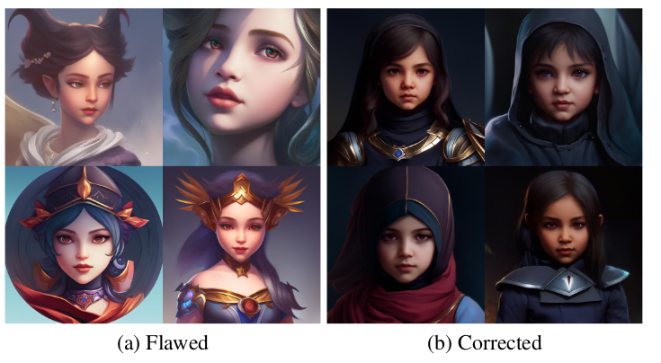

# Introduction

On 15 May 2023 a new paper has been published that proposes fundamental changes to the schedulers involved in (stable) diffusion.

## Common Diffusion Noise Schedules and Sample Steps are Flawed

> We discover that common diffusion noise schedules do not enforce the last timestep to have zero signal-to-noise ratio (SNR), and some implementations of diffusion samplers do not start from the last timestep. Such designs are flawed and do not reflect the fact that the model is given pure Gaussian noise at inference, creating a discrepancy between training and inference. We show that the flawed design causes real problems in existing implementations. In Stable Diffusion, it severely limits the model to only generate images with medium brightness and prevents it from generating very bright and dark samples. We propose a few simple fixes: (1) rescale the noise schedule to enforce zero terminal SNR; (2) train the model with v prediction; (3) change the sampler to always start from the last timestep; (4) rescale classifier-free guidance to prevent over-exposure. These simple changes ensure the diffusion process is congruent between training and inference and allow the model to generate samples more faithful to the original data distribution.

By implementing the changes from the paper, one can generate much brighter / darker images, which was previously not possible.

In this notebook I try to implement the changes from the paper in actual Python code to try them out.